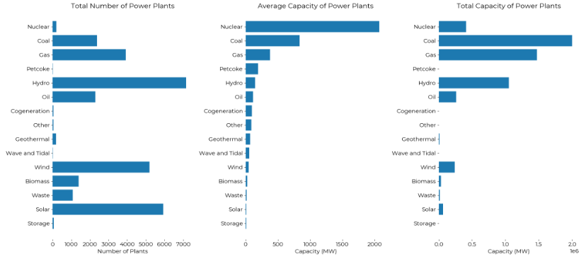
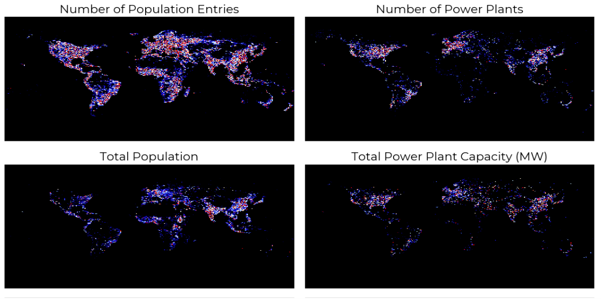
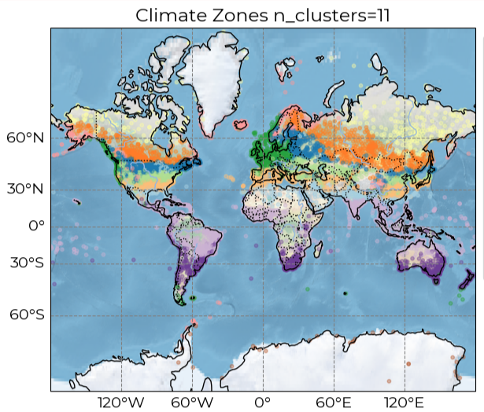

<b>Final Project Report</b>

<b>Don Jones</b>

For the Predictive Analytics Final Project, I studied the development of climate zones based on temperature and precipitation measurements, and how those climate zones could be used to predict expected energy output. I used several datasets, including NCEI and some drawings from NASA. I also used a dataset on Global Power Plants. The motivation for these datasets and this analysis came from one of the earlier projects. I used the Combined Cycle Power Plant dataset to determine if there was a difference in expected power output based on relative humidity. I was able to build a fairly accurate predictive model, so I decided to extend that idea onto other regions. The first analysis was based on total power plant capacity, seen in Figure 1.<br><br><br>

<left>
  
</left>


<br><br><br>

 

The main features discovered were the climate zones. The custom climate zones created in the Final Project somewhat match the Koeppen-Geiger method of climate zone determination. With a bit more time, complete matches could probably be made.

The climate zones did not contribute much to the final predictive models. This is due to the fact that the same features used in engineering the climate zones were used in the predictive models. It is not unexpected.

My recommendation based on the predictive models would be to utilize the dataset and predictive model to determine the best locations to build power plants. The most important feature seems to be proximity to water. This makes sense. I’ve worked in a nuclear power plant before, and some of the data was inaccurate. I changed the data that was inaccurate based on common sense. I’ll have to revisit the data to explore exactly what those inaccuracies were.

Global population also has some discrepancies. There is a paper attached researching the underestimated populations of rural areas. These are the areas that would benefit from the type of analysis presented in the Final project.


<br><br><br>

<left>
  
</left>


Figure 2 displays four maps with global population and total power plant capacity. The discrepancies in population data probably don’t contribute much to inaccuracy of the recommendation; however, the population data can be verified at some later time. I analyzed clustering for groups of 2,5, and 11.<br><br><br>

<div style="display: flex; align-items: flex-start; gap: 16px;">
  <!-- Left Side: Image Container -->
  <div style=" width: 1800px;">
    
  </div>
  
  <!-- Right Side: Wrapping Text -->
  <p style="margin: 0; padding: 30px; overflow-wrap: break-word; word-break: break-word;">
    Our organization should use this data to build new power plants, ideally in places that are underserved. The water proximity was not as effective as I wanted. There were a large amount of inaccuracies that I would like to find the causes of and correct. I would also do further analyses on the expected energy capacity of given terrains.
  </p>
</div>


```python

```
